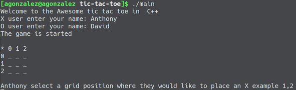

# Tic Tac Toe with C++

This project was created as a practice to apply the knowledge acquired with a [Udacity Course](https://classroom.udacity.com/courses/ud210)



## How to use

In the root folder of the project compile de app with g++
```bash
$ g++ -o main main.cpp
```
Then you can execute with game with: 
```bash
$ ./main
```